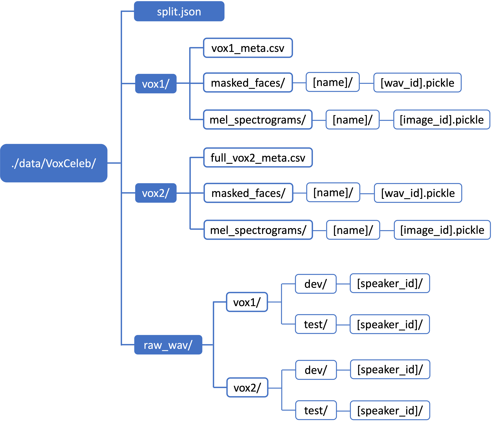

## Environment Setup
Create python env:
```
conda create -n sf2f python=3.6
conda activate sf2f
```
Our repo is developed with python 3.6, CUDA 10.1, and PyTorch 1.7.1. We suggest you to install the PyTorch version which is suitable for your machine, according to [PyTorch Official Website](https://pytorch.org/).
```
# This is the installation command for our environment
conda install pytorch==1.7.1 torchvision==0.8.2 torchaudio==0.7.2 cudatoolkit=10.1 -c pytorch

```

Next, install other python dependencies:
```
pip install -r requirements.txt
```

## Prepare Dataset

**Face Data.** Please download the high-quality face data from [HQ-VoxCeleb](https://github.com/BAI-Yeqi/HQ-VoxCeleb).

**Speech Data.** Please download speech data from VoxCeleb1 and VoxCeleb2 on their [Offical Website](https://www.robots.ox.ac.uk/~vgg/data/voxceleb/).

The speech data need to be converted to mel-spectrograms via STFT with 30ms frame duration, please process the data using our script:
```
python ./scripts/convert_wav_to_mel.py --n_jobs 5
```
`convert_wav_to_mel.py` used parallel processes to speed up the mel extraction. Feel free to adjust `n_jobs` to adapt to the configuration of your machine. 

**Train-val Split.** To create train-validation split:
```
python ./scripts/create_split_json.py
```

**Dataset Structure.** Refer to the following picture for ```data/``` folder structure.



## Download VGGFace2 Resnet Checkpoint
We developed VGGFace Score (VFS) with pretrained ResNet model on VGGFace2 Dataset (https://github.com/cydonia999/VGGFace2-pytorch).

To make sure VGGFace Score can be evaluated, download this https://drive.google.com/file/d/1A94PAAnwk6L7hXdBXLFosB_s0SzEhAFU/view to ```./scripts/weights/resnet50_ft_weights.pkl```.


## Launch Training

To train SF2F 1st-stage, where only encoder & decoder is learned:
```
python train.py \
  --path_opt options/vox/sf2f/sf2f_1st_stage.yaml \
  --batch_size 256 \
  --visualize_every 10 \
  --epochs 12000 \
  --eval_epochs 15
```

To train SF2F 2nd-stage, where fuser is learned while encoder & decoder are frozen:
```
python train.py \
  --path_opt options/vox/sf2f/sf2f_fuser.yaml \
  --batch_size 256 \
  --visualize_every 10 \
  --epochs 50 \
  --eval_epochs 1 \
  --eval_mode_after 100 \
  --train_fuser_only True \
  --pretrained_path \
    output/{sf2f_1st_stage_experiment_pretrained_model}.pt \
  --learning_rate 1e-4
```

To train baseline voice2face:
```
python train.py \
  --path_opt options/vox/baseline/v2f.yaml \
  --batch_size 256 \
  --visualize_every 10 \
  --epochs 12000 \
  --eval_epochs 15
```

## Visualize Training Process

The training process is visualized with [tensorboard](https://github.com/yunjey/pytorch-tutorial/blob/master/tutorials/04-utils/tensorboard).

Start the **tensorboard** server:
```
tensorboard --logdir='./output' --port=8097
```
(Optional) If working on a remote server, mapping the remote tensorboard server to local:
```
ssh -N -L localhost:8000:localhost:8097 user@your_remote_server
```
Visualize the training process by opening `localhost:8097` (from local)  `localhost:8000` (from remote)


## Test
To evaluate 1st-stage SF2F and baseline models:
```
python test.py \
  --path_opt xxxx.yaml \
  --batch_size 1 \
  --checkpoint_start_from output/xxxx/best_with_model.pt \
  --recall_method cos_sim
```

To evaluate SF2F with fuser:
```
python test.py \
  --path_opt options/vox/sf2f/sf2f_fuser.yaml \
  --batch_size 1 \
  --checkpoint_start_from \
    output/{sf2f_fuser_experiment_name} \
  --recall_method cos_sim \
  --face_gen_mode naive \
  --train_fuser_only True \
  --checkpoint L1 cos R10 epoch_2 epoch_4 epoch_6 epoch_8 epoch_10 epoch_12
```

  --checkpoint_start_from output/sf2f_fuser_exp \
  --recall_method cos_sim \
  --face_gen_mode naive \
  --train_fuser_only True \
  --checkpoint epoch_10 epoch_20 epoch_30


  빠르게 SF2F 전체 파이프라인(1st-stage → 2nd-stage → 테스트)을 실험하기 위한 **간소화된 학습 파라미터**를 아래와 같이 구성했습니다. 학습 시간은 수 시간이면 충분하며, 성능 추세 확인과 구조 점검에 유리합니다.

---

## ✅ 1단계: 1st-stage (Encoder + Decoder 학습)

```bash
python train.py \
  --path_opt options/vox/sf2f/sf2f_1st_stage.yaml \
  --batch_size 64 \                         # 빠른 실험을 위한 축소
  --visualize_every 1 \                    # 매 epoch마다 시각화
  --epochs 500 \                           # 12000 → 500으로 대폭 축소
  --eval_epochs 10                         # 10 epoch마다 검증
```

* ✅ 결과 확인 포인트: `val_facenet_cos_sim`, `val_recall@k`가 점진적으로 오르면 학습 성공

---

## ✅ 2단계: 2nd-stage (Fuser만 학습)

```bash
python train.py \
  --path_opt options/vox/sf2f/sf2f_fuser.yaml \
  --batch_size 64 \
  --visualize_every 1 \
  --epochs 30 \                            # 원래 50, 빠르게 30으로
  --eval_epochs 5 \
  --eval_mode_after 5 \                    # 초반부터 평가 진행
  --train_fuser_only True \
  --pretrained_path output/sf2f_1st_stage_exp/best_with_model.pt \
  --learning_rate 1e-4
```

> `pretrained_path`는 1단계 결과 디렉토리의 pt 파일 경로로 교체하세요.

---

## ✅ 3단계: 테스트 및 성능 평가

### 🔹 Fuser 없이 (1st-stage만 평가)

```bash
python test.py \
  --path_opt options/vox/sf2f/sf2f_1st_stage.yaml \
  --batch_size 1 \
  --checkpoint_start_from output/sf2f_1st_stage_exp/best_with_model.pt \
  --recall_method cos_sim
```

### 🔹 Fuser 포함 평가

```bash
python test.py \
  --path_opt options/vox/sf2f/sf2f_fuser.yaml \
  --batch_size 1 \
  --checkpoint_start_from output/sf2f_fuser_exp \
  --recall_method cos_sim \
  --face_gen_mode naive \
  --train_fuser_only True \
  --checkpoint epoch_10 epoch_20 epoch_30
```

---

## ⏱️ 요약 정리

| 단계  | 시간 (GPU 기준) | 설명                            |
| --- | ----------- | ----------------------------- |
| 1단계 | 약 3\~5시간    | 구조 점검과 임베딩 유사도 향상 확인          |
| 2단계 | 약 30분\~1시간  | Fuser 구조 점검, coarse fusion 실험 |
| 3단계 | 수 분 내 완료    | 결과 이미지 생성 및 recall 측정 가능      |

필요 시 Colab이나 ngrok 기반 `TensorBoard` 시각화 설정도 도와드릴 수 있어요.
